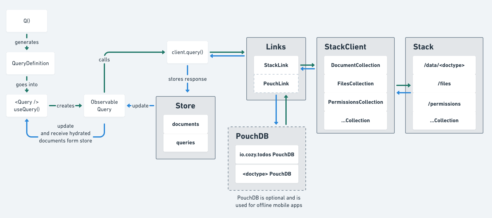
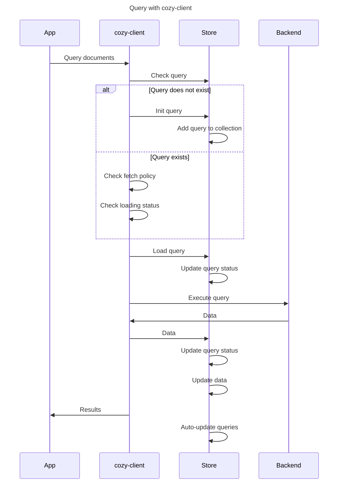
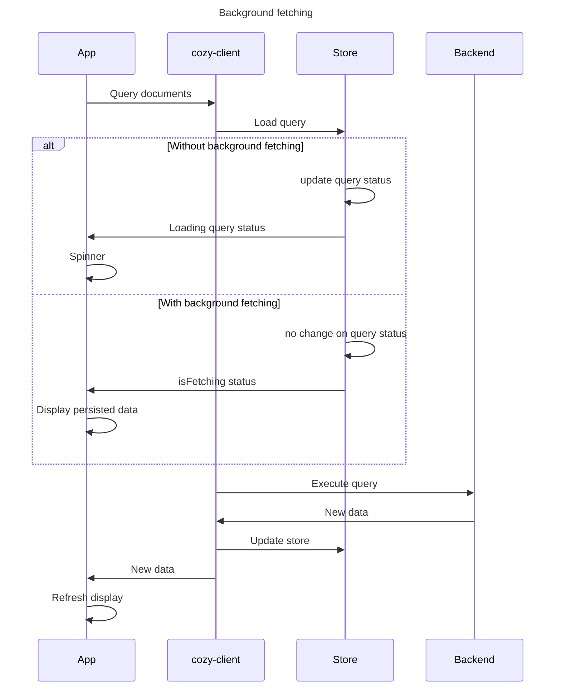

## Cozy-client Architecture

This is an overview of the cozy-client architecture:



<!-- The architecture schema can also be accessed [online here](https://whimsical.co/6AJnnS7v5ePRcuKZysPAF5).
It's created on https://whimsical.co/ — if you need to edit it, ask for an invite from one of the projects maintainers. -->

To explain the architecture, we will see how a request for data flows
through cozy-client through links and finally how the data that has been
fetched is stored in the redux store.

<!-- MarkdownTOC autolink=true -->

- [Cozy-client Architecture](#cozy-client-architecture)
  - [Query definitions](#query-definitions)
  - [Links](#links)
  - [Store](#store)
  - [How does it works?](#how-does-it-works)
  - [Focus on `receiveMutationResult`:](#focus-on-receivemutationresult)

<!-- /MarkdownTOC -->


### Query definitions

To query data, we create a *query definition*: an object describing what documents to fetch.

```
{
  doctype: "io.cozy.todos",
  selector: {
    "finished": true
  }
}
```

It is typically created via the helper `Q` that provides a fluid interface
to create a *Query Definition*.

```jsx
const qdef = Q('io.cozy.todos').where({ finished: true })
```

Then we need to execute this query, fetch the data, and storing it.

```jsx
await client.query(qdef)
```

### Links

When executed, *Query definitions* are passed down to *Links*.

Links accept query definitions and can choose

- either to return a response
- or to pass the query definition down to the next link.

> ℹ️ This is how offline support is implemented: on mobile, a PouchLink (we
use PouchDB under the hood) is added as a link to cozy-client, before the
default StackLink. The PouchLink can decide:

> - either to pass down the query definition to the next link (if the PouchLink has not been synchronized for example),
> - or to respond to the request by communicating directly with PouchDB.

At the moment there are only two links:

- StackLink : fetches data over HTTP by communicating to the Cozy's Stack via the
StackClient.
- PouchLink : fetches data from a local PouchDB. Useful to have offline-ready
  applications.

### Store

When links have responded with data, the data is stored inside the
*redux store* that is internal to cozy-client. This redux store
brings observability to cozy-client, and allows for connection of
UI components to the data.

> ℹ️ You do not need to use Redux in your application to use cozy-client.

> ℹ️ You can connect your own store to cozy-client. It is useful for more
advanced techniques where you create selectors directly on the data
of cozy-client.

The redux store is composed of two collections: `documents` and `queries`:

- `documents` stores the data indexed by [doctype](https://docs.cozy.io/en/cozy-doctypes/docs/) then `_id`
- `queries` store information for each query that has been done by cozy-client.
    * ids of the documents that match the query
    * whether the server has more documents that can be fetched (useful for
      pagination)
    * whether the query is being loaded.

```js
{
    documents: {
        'io.cozy.todos': {
            'todo-id-1': {
                finished: true,
                label: "Add architecture document for cozy-client"
            }
        }
    },
    queries: {
        finishedTodos: {
            data: ['todo-id-1']
        }
    }

}
```
> ⚠️ If queries are not named, a name is automatically generated, but this means that the `queries`
collection can grow indefinitely. This is why you are encouraged to name your queries : `client.query(qdef, { as: 'finishedTodos'})`.
See these [naming rules](https://github.com/cozy/cozy-guidelines?tab=readme-ov-file#naming-of-queries) that are followed at Cozy.

ℹ️ See the [react integration](/docs/react-integration.md) for more insight about the glue between the redux store and the UI.


#### React example

Let's take a simple React example to demonstrate the connection of UI components to the data:

```jsx
const { data, fetchStatus } = useQuery(Q('io.cozy.todos'), {'as': 'todoslist'})
if (fetchStatus === 'loading') {
  return <Spinner />
}
if (fetchStatus === 'loaded') {
  return <TodoLists todos={data} />
}
if (fetchStatus === 'failed') {
  return <Error />
}
```

This way, a spinner will be displayed during the time the query is actually run. Once the query is done, data for this query is available and can be displayed.

On this example, any data change on the `io.cozy.todos doctype` will be handled by cozy-client and reflected in the `data` array returned by `useQuery`. Thus, the app is reactive to any data change, with no hassle for the developer.

See [the auto query update](#auto-query-update) mechanism for more insights about this mechanism.


### Queries

Here, we describe what happens internally when a query is called from an app.

First, it is important to understand that each query is stored in the store, in a `queries` associative array. Each query has a unique id, a set of metadata, and the list of retrieved document ids.

For example:
```js
{
  query1: {
    definition: {
      ...
    },
    fetchStatus: "loaded",
    lastFetch: 1716989816939,
    lastUpdate: 1716989816939,
    hasMore: false,
    count: 2,
    bookmark: "xyz",
    data: ["docId1", "docId2"] // confusingly named `data`, but only stores ids
  }
}
```

#### Fetch status

An important attribute used for the query lifecycle is the `fetchStatus`.
It can take the following values:
- `pending`: the query is about to be run for the first time.
- `loading`: the query is currently running and might return results. From a UX perspective, it is often used by apps to display a spinner.
- `loaded`: the query had been run and returned results.
- `failed`: the last query execution failed.

When a query is called for the first time, it is first initialized in the `queries` collection in the store, with the `pending` status.

If the query already exists in the store, its status is checked to ensure that it is not already in a `loading` state. If it the case, a de-duplication mechanism is used to return the stored existing query. See the [PR](https://github.com/cozy/cozy-client/pull/988) for more details.

Then, the query is "loaded", making its status on `loading`.

Then, the query status is set on `loading` and the query actually run.
When results are retrieved from the database, the status is set to `loaded` and some additional information are saved in the query store, such as `lastFetch` and `lastUpdate`.
If any new data is retrieved by the query, all the documents ids retrieved by the query are then stored in the `data` array.

Likewise, the `documents` collection is updated as well with the full documents content.


#### Auto query update

Since there is a link between queries and documents through the ids list in each query object, we need to be able to deal with changes occuring in the documents collection, i.e. when documents are added or deleted.

For this, cozy-client has a mechanism called "query updater": each time a query is run, all the queries in the store are re-evaluated directly in the store.
That means that for each query, we take its definition, convert it into a mango predicate (see [here](#in-memory-queries-evaluation) for details), and run it against the store's document collection.
For each query result, we check if there is any change in the known ids list, and update it accordingly.

Thanks to this, we ensure that all the queries are always up-to-date, and apps can be effectively rendered thanks to the [react integration](/docs/react-integration.md).


#### Fetch policy and query naming

The fetch policy is a useful mechanism to prevent excessive fetching.
It is optionnaly defined for each query, to specify a minimum time between 2 actual fetches.

It means that after a query is run, if it is called again within this time, it will not be executed.

Here is an example to demonstrate how it works:
```js
const queryDef = Q('io.cozy.todos').where({checked: true})
const queryOptions = {
  as: 'io.cozy.todos/checked/true', // query unique name, to find it in the store
  fetchPolicy: CozyClient.fetchPolicies.olderThan(10 * 1000) // fetch policy, for 10 seconds
}
// First query
let {data: result } = await client.query(queryDef, queryOptions) // result is filled

// Second query, within the fetch policy time interval
setTimeout(async () => {
  {data: result } = await client.query(queryDef, queryOptions) // result is null
}, 5000)

// Third query, after the fetch policy time interval
setTimeout(async () => {
  {data: result } = await client.query(queryDef, queryOptions) // result is filled
}, 10000)
```

If the query had been run before the 10 seconds, an early return will happen and nothing will be updated in the store.

💡 In this example, we do not benefit from the React integration like demonstrated in this [example](#react-example) with `useQuery`. When using it, the data is returned even though the fetch policy applies, by taking it directly from the store, to ensure the component is correctly rendered.


💡 In a React context, thanks to the auto-query updater, the data will not be stale if there is a data change in the app: indeed, any change on the documents will trigger the in-memory re-evaluation of the query and a render on the app if something is different.


ℹ️ The `as` option is used to name the query, which is always a good idea to ensure that it has a unique name. When it's not specified, a random id is generated, resulting in potential query duplication in the store. Likewise, one must be very careful to prevent queries with the same name, as it would mixup results in the store.
Note that you can easily view each query using [Devtools](https://github.com/cozy/cozy-libs/tree/master/packages/cozy-devtools) to identify duplicates and follow the [guidelines for the naming](https://github.com/cozy/cozy-guidelines?tab=readme-ov-file#naming-of-queries).


#### Complete query flow



#### Persisted store and background fetching stategy

An app can decide to persist its store in localstorage. See [here](https://github.com/cozy/cozy-home/blob/c47858515d4f95c24fa88a6b96bb0b500b947424/src/store/configureStore.js#L46) for an example.
When doing so, the app loads the store when it starts and benefit from the instant available cached data.

But, the data could have significantly evolved between the last store save and the start, making the documents potentially stale.
Hopefully, since the fetch policy is probably expired, queries will be run again, retrieving fresh data. Unfortunately, this might cause an immediate spinning display on the app when it starts, even though there is available data thanks to the persisted store.

To solve this, a `backgroundFetching` option can be set, at the query level, or at the store level (enabled for all queries).

When the query is loaded, it simply keeps the query status in `loaded` state (rather than setting a `loading` state) and set a new `isFetching` attribute, stored in the query.
Thanks to this, the app can adapt its display to avoid the "spinning effect", and might inform the user that data is being updated in the background, without refreshing the whole app.

See [this PR](https://github.com/cozy/cozy-client/pull/1211) for more insights.


Here is a simplified execution sequence with or without background fetching:


### Updates

Here, we detail what happens when a document is updated, i.e. a mutation happens, typically after a `client.save`.

If the document `_id` does not exist in the store's `documents` collection, i.e. after the a creation, it is simply added.
If it already exists, the document content is updated in this collection, after the backend response.

Furthermore, just like with the queries, any mutation triggers the [auto query updater](#auto-query-update), that can result in adding or removing document ids.

Thanks to it, the app is guaranteed to have the up-to-date documents, returned from the `documents` collection.

⚠️ As already mentioned, when a mutated document already exists in the store throught its `_id`, it is updated with the new content. However, this update never removes existing fields, it only merges or adds new fields. This is typically useful when two queries retrieve the same document, but not with all the fields.
Let us illustrate with this example:

```js
const Q1 = { definition: Q('io.cozy.todos').getById('my-todo'), options: { as: 'io.cozy.todos/my-todo', fetchPolicy: lessThan30s }}
const Q2 = { definition: Q('io.cozy.todos').getById('my-todo').select(['label']), options: { as: 'io.cozy.todos/my-todo/withLabel' }}

await client.query(Q1) // returns { _id: 'my-todo', _type: 'io.cozy.todos', label: 'TODOTODO' }, from the database
await client.query(Q2) // returns { label: 'TODOTODO' }, from the database
await client.query(Q1) // returns { _id: 'my-todo', _type: 'io.cozy.todos', label: 'TODOTODO' }, from the store
```

Q1 retrieves the full content of 'my-todo' while Q2 only retrieves its label. When Q2 is run, 'my-todo' already exists in the store, as Q1 was previsouly run. However, the fields retrieved by Q1 for 'my-todos' but absent from Q2 are not lost. This way, when Q1 is run again, the results fetched from the store (thanks to the fetch policy) will include all the fields.

⚠️ The problem is when some fields are removed from a document: the store will not reflect this change and result in stale data.
To avoid this side-effect, one could set an attribute to `undefined` instead of removing it, as a workaround.


### In-memory queries evaluation

Each time a change occurs in the store's `documents` collection, either through a query or an update, all the stored queries are dynamically re-evaluated.

As we do not want to request the actual database each time, we do the evaluation directly from the store, in memory.

To achieve this, we need to evaluate queries the same way it would have been done on the database side. Our query system relies on mango, a [mongo-like query system](https://docs.couchdb.org/en/stable/api/database/find.html#find-selectors) supported by CouchDB, the Cozy database.

We rely on [sift.js](https://github.com/crcn/sift.js) for the in-memory query evaluation. This library is able to take as input a mongo query definition and transform it into a javascript predicate. Then, all the queries are evaluated on the stores's `documents`, and efficiently updated accordingly to the results.

💡 If you want to know more about our query system and syntax, please check [this documentation](https://docs.cozy.io/en/tutorials/data/queries/).

⚠️ Please note that there is not a perfect matching between mango operators and sift, see [this issue](https://github.com/cozy/cozy-client/issues/1132) for instance.

ℹ️ You can also directly run a query on the store's `documents`, and never actually use the database. This is useful when you know you have already the documents, typically after a sync. Simply use the `executeFromStore` option:

```js
await client.query(queryDef, { executeFromStore: true})
```

