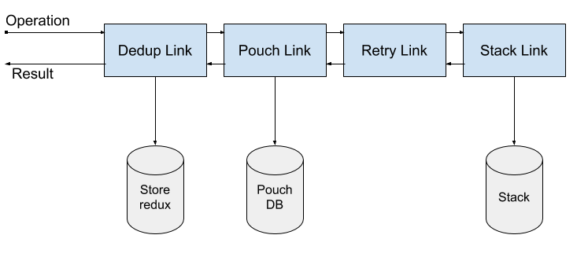

<!-- MarkdownTOC autolink=true -->

- [What is it ?](#what-is-it-)
- [Authoring a link](#authoring-a-link)

<!-- /MarkdownTOC -->

## What is it ?

Cozy Link is a simple yet powerful way to describe how you want to get the result of a query. Think of it as a sort of "middleware".

Links are units that you can chain together to define how each query should be handled: this allows us to use different sources of data, or to control the request lifecycle in a way that makes sense for your app. The first link operates on an operation object and each subsequent link operates on the result of the previous link:



In the chain example pictured above, the Dedup link would avoid re-fetching the same query, the PouchDB link would try to get the data from a local Pouch instance, and fallback to the Stack link, assisted by the Retry link that will try to fetch again the query in case of a network error.

## Authoring a link

There are two ways of creating a new link. First, you can instantiate a `CozyLink` and pass a request handling function to its constructor:

```js
const logLink = new CozyLink((operation, options, result, forward) => {
  console.log(JSON.stringify(operation))
  return forward(operation, options, result)
})
```

Or you can subclass `CozyLink`:

```js
class LogLink extends CozyLink {
  request(operation, options, result, forward) {
    console.log(JSON.stringify(operation))
    return forward(operation, options, result)
  }
}
```

At the core of a link is the `request` method. It takes the following arguments:
 - `operation`: the operation definition being passed through the link ;
 - `result`: the (maybe incomplete) result processed by the previous link ;
 - `forward`: (optional) specifies the next link in the chain of links.

When the `request` method is called, the link has to return data back. Depending on where the link is in the chain, and its ability to provide the requested data, it will either use the `forward` callback to defer to the next link the task of providing (or completing) the data, or return back a result on its own.
