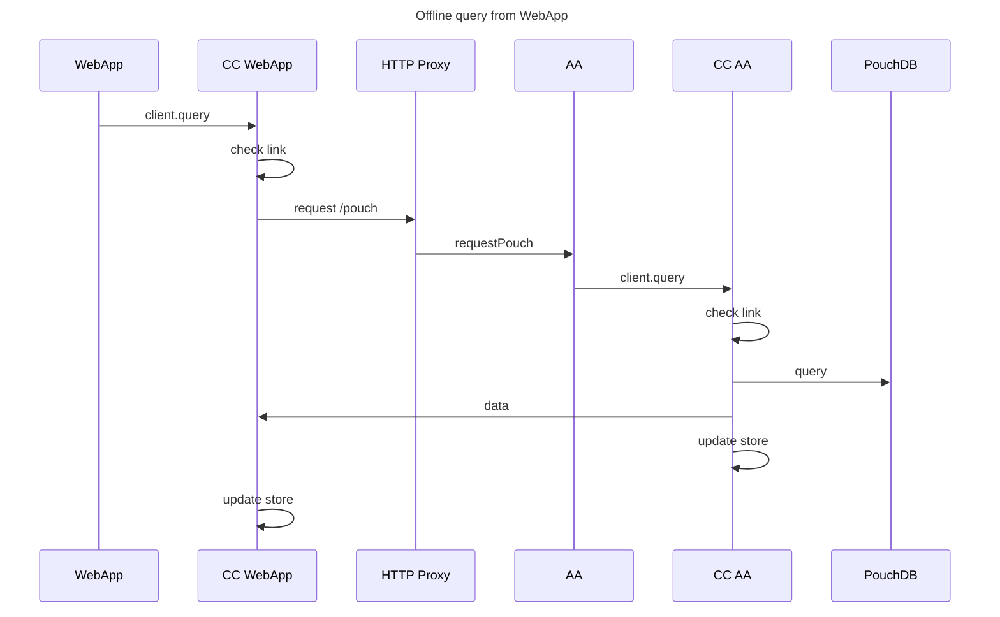
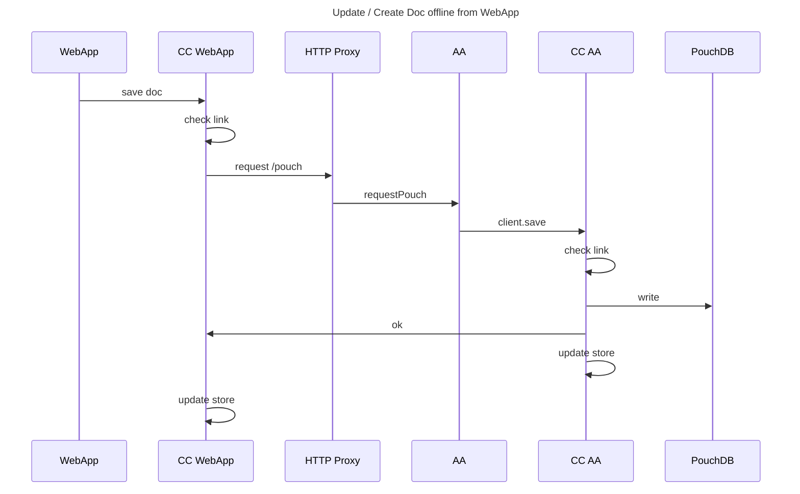
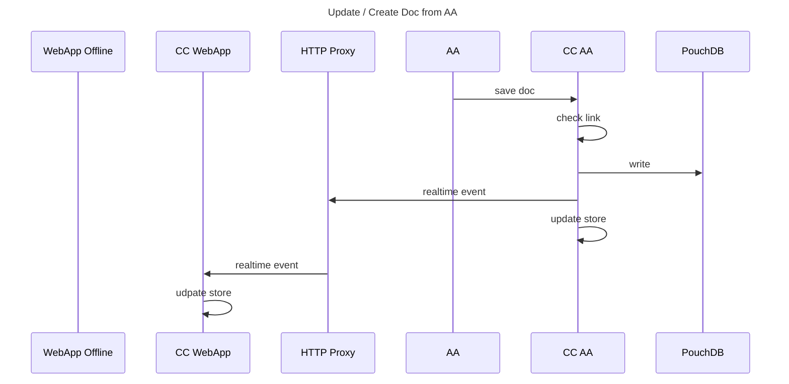
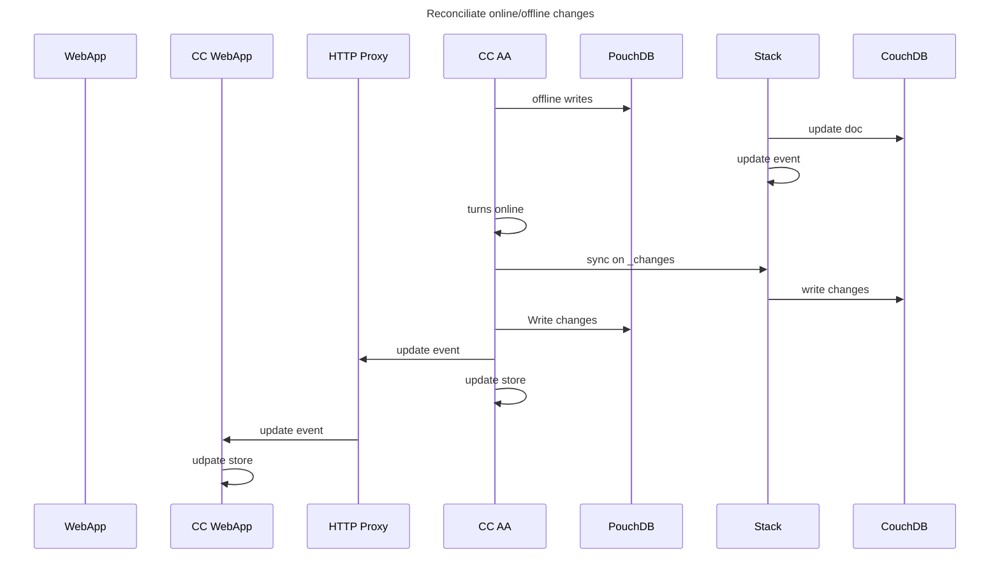
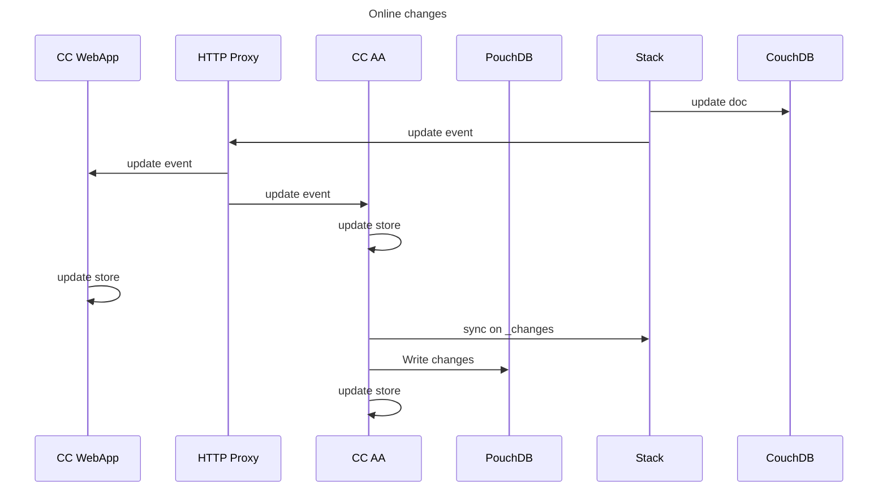

```mermaid
---
title: Offline query from WebApp
---
sequenceDiagram
    participant WebApp
    participant CC_WebApp as CC WebApp
    participant Proxy as HTTP Proxy
    participant AA
    participant CC_AA as CC AA
    participant PouchDB

    WebApp->>CC_WebApp: client.query
    CC_WebApp->>CC_WebApp: check link
    CC_WebApp->>Proxy: request /pouch
    Proxy->>AA: requestPouch
    AA->>CC_AA: client.query
    CC_AA->>CC_AA: check link
    CC_AA->>PouchDB: query
    CC_AA->>CC_WebApp: data
    CC_AA->>CC_AA: update store
    CC_WebApp->>CC_WebApp: update store
```

```mermaid
---
title: Update / Create Doc offline from WebApp
---
sequenceDiagram
    participant WebApp
    participant CC_WebApp as CC WebApp
    participant Proxy as HTTP Proxy
    participant AA
    participant CC_AA as CC AA
    participant PouchDB

    WebApp->>CC_WebApp: save doc
    CC_WebApp->>CC_WebApp: check link
    CC_WebApp->>Proxy: request /pouch
    Proxy->>AA: requestPouch
    AA->>CC_AA: client.save
    CC_AA->>CC_AA: check link
    CC_AA->>PouchDB: write
    CC_AA->>CC_WebApp: ok
    CC_AA->>CC_AA: update store
    CC_WebApp->>CC_WebApp: update store
```

```mermaid
---
title: Update / Create Doc from AA
---
sequenceDiagram
    participant WebAppOff as WebApp Offline
    participant CC_WebApp as CC WebApp
    participant Proxy as HTTP Proxy
    participant AA
    participant CC_AA as CC AA
    participant PouchDB


    AA->>CC_AA: save doc
    CC_AA->>CC_AA: check link
    CC_AA->>PouchDB: write
    CC_AA->>Proxy: realtime event
    CC_AA->>CC_AA: update store
    Proxy->>CC_WebApp: realtime event
    CC_WebApp->>CC_WebApp: udpate store


```

```mermaid
---
title: Reconciliate online/offline changes
---
sequenceDiagram
    participant WebApp
    participant CC_WebApp as CC WebApp
    participant Proxy as HTTP Proxy
    participant CC_AA as CC AA
    participant PouchDB
    participant Stack
    participant CouchDB

    CC_AA->>PouchDB: offline writes
    Stack->>CouchDB: update doc
    Stack->>Stack: update event
    CC_AA->>CC_AA: turns online
    CC_AA->>Stack: sync on _changes
    Stack->>CouchDB: write changes
    CC_AA->>PouchDB: Write changes
    CC_AA->>Proxy: update event
    CC_AA->>CC_AA: update store
    Proxy->>CC_WebApp: update event
    CC_WebApp->>CC_WebApp: udpate store

```

```mermaid
---
title: Online changes
---
sequenceDiagram
    participant CC_WebApp as CC WebApp
    participant Proxy as HTTP Proxy
    participant CC_AA as CC AA
    participant PouchDB
    participant Stack
    participant CouchDB

    Stack->>CouchDB: update doc
    Stack->>Proxy: update event
    Proxy->>CC_WebApp: update event
    Proxy->>CC_AA: update event
    CC_AA->>CC_AA: update store
    CC_WebApp->>CC_WebApp: update store

    CC_AA->>Stack: sync on _changes
    CC_AA->>PouchDB: Write changes
    CC_AA->>CC_AA: update store

```