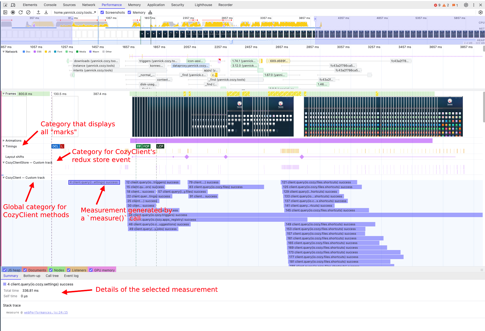

# Performances analysis

CozyClient allows to measure its internal performances through PerformanceAPI.

This document aims to describe how to use this API.

## Nomenclature

- `PerformanceAPI`: The API provided by CozyClient for measuring timings in the code base
- `Performance devtools`: Browsers devtools pane dedicated to performance (i.e. [Chrome devtools](https://developer.chrome.com/docs/devtools/performance) and [Firefox profiled](https://profiler.firefox.com/docs/#/))
- `Mark`: A temporal event
- `Measure`: A timing measurement between two temporal events

## The API

The PerformanceAPI can be used to measure code execution timings. It is meant to wrap platform specific APIs like web's [Performance API](https://developer.mozilla.org/en-US/docs/Web/API/Performance), or React Native's [dedicated plugin](https://github.com/oblador/react-native-performance).

For now the CozyClient's API only exposes a limited subset of methods, which are `mark()` and `measure()` with slightly different interfaces than their original implementation in order to fit Cozy's needs without the original APIs complexity (their interface will be described in following sections).

Those methods can be used to measure temporal events and their duration. They do not output anything in the console but they maintain a list of measurements that can be then visualized in dedicated tools like browsers' Performance devtools.

### API initialization

Because the measurement framework may differ based on the platform (i.e. web, mobile, nodejs), the PerformanceAPI has to be injected through CozyClient and CozyLinks constructor before being used.

Because CozyClient's main usage is in web apps, a `webPerformanceAPI` implementation is already provided by CozyClient. On other platforms, the implementation should be provided by the consuming app.

Example of CozyClient initialization with web compatible version of the PerformanceAPI
```js
import CozyClient, { webPerformanceAPI } from 'cozy-client'

const client = new CozyClient({
  uri,
  schema,
  token,
  performancesApi: webPerformanceAPI
})
```

By default, CozyClient will not do any measurement if no PerformanceAPI is injected.

### Mark method

The first API method is `mark(markName)`.

This method's goal is to add a temporal mark that can be used for future measurements. For example it can be used to mark when a method starts or when any particular event happens (i.e. hiding splashscreen in mobile app).

Exemple of marking the call of CozyClient's `query()` method
```js
async query(queryDefinition, { update, executeFromStore, ...options } = {}) {
  const markName = client.mark(`client.query(${queryDefinition.doctype})`)

  // ... method implementation
}
```

The method takes a `markName` argument. This name can be any string. The common usage is to describe the happening event.

Because we expect to measure some methods that are called multiple times in parallel, the `mark(markName)` method will internally prefix the `markName` with some unique ID. This would ensure each mark is uniquely identified.

```js
async query(queryDefinition, { update, executeFromStore, ...options } = {}) {
  const markName = client.mark(`Some mark name`)

  console.log(markName) // "42 Some mark name"
}
```

### Measure method

The previously described `mark(markName)` method can be used to place some temporal marks in the code. The `measure(options)` method can be used to measure the elapsed time since a specified temporal mark.

Example of measuring the elapsed time between the call of CozyClient's `query()` method and its ending 
```js
async query(queryDefinition, { update, executeFromStore, ...options } = {}) {
  const markName = client.mark(`client.query(${queryDefinition.doctype})`)

  // ... method implementation

  this.performanceApi.measure({ markName })
}
```

This methods takes an `options` argument that can contains:
- `markName`: the reference mark used as starting point for the measurement
- `measureName` (optional): the name of the measure that will be displayed by visualizing tools
  - if not provided, the `markName` will be used instead. This parameter is useful when doing multiple different measures that use the same mark as starting point
- `color` (optional): can be used to specify the color of the event when displayed in visualizing tools
  - only a specific set of semantic colors can be used (i.e. `primary`, `secondary`, `error` etc.). Available colors are described in the JSDoc
- `category` (optional): can be used to split measurements in multiple categories when displayed in visualizing tools
  - this can be any string. Visualizing tools tends create as many category as provided (hence their are some exceptions like ReactNative's flipper plugin)

Example of measuring the elapsed time between the call of CozyClient's `query()` method and its ending or its failing block
```js
async query(queryDefinition, { update, executeFromStore, ...options } = {}) {
  const markName = client.mark(`client.query(${queryDefinition.doctype})`)

  try {
    // ... method implementation

    this.performanceApi.measure({
      markName: markQuery,
      measureName: `${markName} success`,
      category: 'CozyClient queries'
    })
  } catch (error) {
    this.performanceApi.measure({
      markName: markQuery,
      measureName: `${markName} error`,
      category: 'CozyClient queries',
      color: 'error'
    })
  }
}
```

## Adding measurements

On initial implementation, we chose to measure some parts of the code that we estimated useful and with potential high impact on performances (i.e. queries, store management, pouch management etc.).

We expect to need more measurements in the future but we need to care to keep the balance beetween having useful measurements and to not visualy overload the measurement graphs.

The API is meant to be simple to use so measurements can be quickly temporarily added in development environments.

In the scenario where a measurement seems to be useful enough to be permanently added to our code base, please consider discussing this choice with the development team.

## Web usage

On web environment, it is possible to inject the already provided `webPerformanceAPI` implementation of the API.

Example of CozyClient initialization with web compatible version of the PerformanceAPI
```js
import CozyClient, { webPerformanceAPI } from 'cozy-client'

const client = new CozyClient({
  uri,
  schema,
  token,
  performancesApi: webPerformanceAPI
})
```

Then CozyClient will use this implementation to do its internal measurements.

The consuming app can also add its own measurements by either:
- Calling `client.performanceAPI.mark()` and `client.performanceAPI.measure()` method
- Directly calling the web native API `performance.mark()` and `performance.measure()`
  - However, please keep in mind that if both APIs will produce the same output, their interface is slightly different. So for code homogeneity purpose, please prefer using the CozyClient's API

When the PerformanceAPI is used, then the result can be visualized in the browser's Performance develools.



## Other platforms

No implementation is provided by CozyClient for other platforms. So each consuming app needs to provide their own implementation of the API.

The API interface is described in the JSDoc.

Example of custom implementations:
- Flagship App: [feat: Add performance measurements](https://github.com/cozy/cozy-flagship-app/pull/1264)

## Production environment

By default, if no API is injected, then CozyClient will use the `defaultPerformanceAPI` implementation that does nothing.

The consuming app is then responsible to inject an implementation or keep the default one that doesn't do any profiling, regarding if the app is built for development environments or for production.

PerformancesAPI seems to have an impact on performances light enough to be kept on production. However, we suggest to disable them in that environement if possible.
